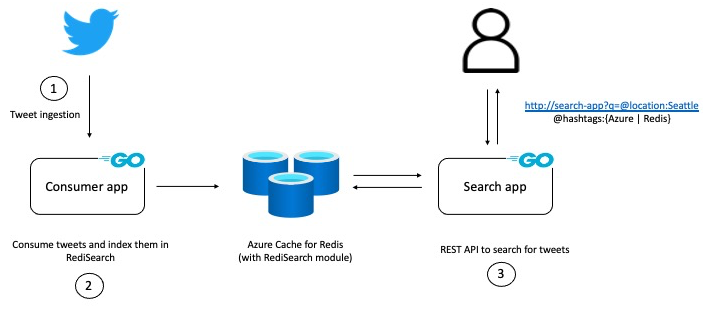

# Tweet analysis with Redis

A practical example on how to use [RediSearch](https://oss.redislabs.com/redisearch/) with [Azure Cache for Redis](https://docs.microsoft.com/azure/azure-cache-for-redis/cache-overview?WT.mc_id=data-13024-abhishgu) with the help of a [Go](https://golang.org/) service built using the [RediSearch Go client](https://github.com/RediSearch/redisearch-go). By the end of this blog, you should have a set of applications that let you ingest tweets in real-time and query them flexibly using RediSearch.

You will learn how to:

- Work with RediSearch indexes
- Use different RediSearch data types such as `TEXT`, `NUMERIC`, `TAG` etc.
- How to build an application to expose RediSearch capabilities
- How to deploy the service components to Azure with just a few commands
- Analyse tweets data by querying RediSearch