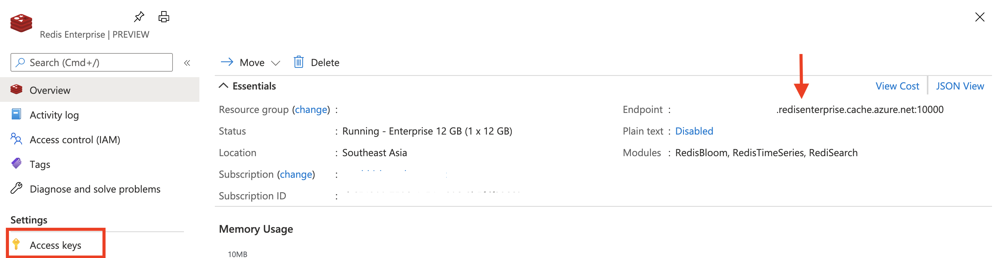

# redisearch

[Redis](http://redis.io/) has a [versatile set of data structures](https://redis.io/topics/data-types-intro) ranging from simple [Strings](https://redis.io/topics/data-types-intro#redis-strings), all the way to powerful abstractions such as [Redis Streams](https://redis.io/topics/streams-intro). The native data types can get you quite far, but there are certain use cases where you have to resort to workarounds. One such example is the requirement of using secondary indexes in Redis in order go beyond the *key* based search/lookup for richer query capabilities. By all means, you can [use sorted Sets, Lists etc. to get the job done](https://redis.io/topics/indexes), but there are trade-offs you need to factor in. 

**Enter RediSearch!**

[RediSearch](https://oss.redislabs.com/redisearch/) provides flexible search capabilities, thanks to a first-class secondary indexing engine. It offers powerful features such as Full-Text Search, Auto-Completion, Geographical indexing etc.

> RediSearch is available as a [Redis Module](https://redis.io/topics/modules-intro)

## Introduction

This blog post demonstrates a practical example on how to use RediSearch with [Azure Cache for Redis](https://docs.microsoft.com/azure/azure-cache-for-redis/cache-overview?WT.mc_id=data-13024-abhishgu) with the help of a [Go](https://golang.org/) service built using the [RediSearch Go client](https://github.com/RediSearch/redisearch-go). By the end of this blog, you should have a set of applications that let you ingest tweets in real-time and query them flexibly using RediSearch.

You will learn how to:

- Work with RediSearch indexes
- Use new Redis 2.0 feature to create data in way that is seamlessly indexed by RediSearch
- Use different RediSearch data types such as `TEXT`, `NUMERIC`, `TAG` etc.
- How to build an application to expose RediSearch capabilities
- How to deploy the service components to Azure with just a few commands
- Analyse tweets data by querying RediSearch

## Redis Enterprise tiers on Azure Cache for Redis

Redis Enterprise is available in the form of [two new tiers on Azure Cache for Redis](https://redislabs.com/blog/announcing-public-preview-of-redis-enterprise-on-azure-cache/), allowing developers access to a rich set of modules including RediSearch, which is the key focus of this blog. This is part of a native Azure service that is operated and supported by Microsoft. At the time of writing, this feature is available in *Preview* mode. For more information I would recommend referring to the following resources:

- [Deepening Our Partnership with Microsoft to Grow Redis Enterprise in the Cloud](https://redislabs.com/blog/microsoft-partnership-redis-enterprise-cloud/)
- [Microsoft and Redis Labs collaborate to give developers new Azure Cache for Redis capabilities](https://azure.microsoft.com/en-us/blog/microsoft-and-redis-labs-collaborate-to-give-developers-new-azure-cache-for-redis-capabilities/)
- [Redis Enterprise features on Azure Cache for Redis](https://azure.microsoft.com/en-in/updates/)redis-enterprise-features-on-azure-cache-for-redis-coming-soon/)

## Application overview

As mentioned earlier, the service lets you consume tweets in real-time and makes them available for querying via RediSearch. 

TODO diagram

It has two components:

- Consumer/Indexer: Reads from the [Twitter Streaming API](), creates the index and continuously adds tweets data (in Redis `HASH`es) as they arrive.
- Search service: A REST API that allows you to search tweets using the RediSearch [query syntax](https://oss.redislabs.com/redisearch/Query_Syntax/)

At this point, I am going to dive into how to get the solution up and running so that you can see it in action. However, if you're interested in understanding how the individual components work, please refer to the **Code walk through** section. 

> The code for this blog is available on Github TODO link

## Pre-requisites

To begin with, you will need an Azure account - you can [get one for free](https://azure.microsoft.com/free/?WT.mc_id=data-13024-abhishgu)!

The above mentioned service components will be deployed to [Azure Container Instances](https://docs.microsoft.com/azure/container-instances/container-instances-overview?WT.mc_id=data-13024-abhishgu) using native Docker CLI commands. 

> This capability is enabled by [integration between Docker and Azure](https://docs.docker.com/engine/context/aci-integration/)

You will need Docker Desktop version 2.3.0.5 or later, for [Windows](https://desktop.docker.com/win/edge/Docker%20Desktop%20Installer.exe), [macOS](https://desktop.docker.com/mac/edge/Docker.dmg), or install the [Docker ACI Integration CLI for Linux](https://docs.docker.com/engine/context/aci-integration/#install-the-docker-aci-integration-cli-on-linux).

To use Twitter Streaming API, you will also need a Twitter developer account. If you don't have one already, please [follow these instructions](https://developer.twitter.com/en/apply-for-access).

## RediSearch in action!

Start off by using this quickstart to [setup an Enterprise tier cache](https://docs.microsoft.com/azure/azure-cache-for-redis/quickstart-create-redis-enterprise?WT.mc_id=data-13024-abhishgu) on Azure.

> Once you finish the setup, ensure that you have the following information handy: the Redis host name and Access key



Both the components of our service are available as Docker containers - [Tweet indexing service](https://hub.docker.com/repository/docker/abhirockzz/redisearch-tweets-consumer) and the [Search API service](https://hub.docker.com/repository/docker/abhirockzz/redisearch-tweets-search). 

> If you need to build you own Docker images, please use the respective `Dockerfile` available on the GitHub repo.

You will now see how convenient it is to deploy these to [Azure Container Instances](https://docs.microsoft.com/azure/container-instances/?WT.mc_id=data-13024-abhishgu), that allows you to run Docker containers on-demand in a managed, serverless Azure environment.

### Deploy to Azure

A `docker-compose.yml` file defines the individual components (`tweets-search` and `tweets-indexer`). All you need to do is update it to replace the values for your Azure Redis instance as well as your Twitter developer account credentials. Here is the file in its entirety (GitHub repo link):

```yml
version: "2"
services:
  tweets-search:
    image: abhirockzz/redisearch-tweets-search
    ports:
      - 80:80
    environment:
      - REDIS_HOST=<azure redis host name>
      - REDIS_PASSWORD=<azure redis access key>
      - REDISEARCH_INDEX_NAME=tweets-index
  tweets-indexer:
    image: abhirockzz/redisearch-tweets-consumer
    environment:
      - TWITTER_CONSUMER_KEY=<twitter api consumer key>
      - TWITTER_CONSUMER_SECRET_KEY=<twitter api consumer secret>
      - TWITTER_ACCESS_TOKEN=<twitter api access token>
      - TWITTER_ACCESS_SECRET_TOKEN=<twitter api access secret>
      - REDIS_HOST=<azure redis host name>
      - REDIS_PASSWORD=<azure redis access key>
      - REDISEARCH_INDEX_NAME=tweets-index
```

[Create an Azure context](https://docs.microsoft.com/azure/container-instances/quickstart-docker-cli?WT.mc_id=data-13024-abhishgu#create-azure-context):

```bash
docker login azure
docker context create aci aci-context
docker context use aci-context
```

Clone the GitHub repo:

```bash
git clone TODO
cd TODO
```

Deploy both the service components as part of a [Container group](https://docs.microsoft.com/azure/container-instances/container-instances-container-groups?WT.mc_id=data-13024-abhishgu):

```bash
docker compose up -p azure-redisearch-app
```

> Docker Compose commands currently available in an ACI context start with `docker compose`. Please note that it is *not* the same as `docker-compose` (with a hyphen).

You will see an output similar to this:

```bash
[+] Running 1/3
 ⠿ Group azure-redisearch-app  Created                                                           8.3s
 ⠸ tweets-search               Creating                                                          6.3s
 ⠸ tweets-indexer              Creating                                                          6.3s
```

Wait for services to start - you can also check the [Azure portal](https://docs.microsoft.com/azure/container-instances/container-instances-quickstart-portal?WT.mc_id=data-13024-abhishgu#view-container-logs).

Once both the services are up and running, you can check their respective logs:

```bash
docker logs azure-redisearch-app_tweets-indexer
docker logs azure-redisearch-app_tweets-search
```

If all goes well, the tweets consumer service should have kicked off. It will read a stream of tweets and persist them to Redis.

## The moment of truth!

It's time to query the tweets data. To do so, ypu can access the REST API in Azure Container Instances with an IP address and a fully qualified domain name (FQDN) (read more in [Container Access](https://docs.microsoft.com/azure/container-instances/container-instances-overview?WT.mc_id=data-13024-abhishgu#container-access)).

To find the IP, run `docker ps` and check the `PORTS` section in the output (as depicted below):

```bash
docker ps

//output

CONTAINER ID                          IMAGE                                   COMMAND             STATUS              PORTS
azure-redisearch-app_tweets-search    abhirockzz/redisearch-tweets-search                         Running             20.197.96.54:80->80/tcp
azure-redisearch-app_tweets-indexer   abhirockzz/redisearch-tweets-consumer                       Running             
```

You can now run all sorts of queries! Before diving in, here is a quick idea of the indexed attributes which you can use in your search queries:

- `id` - this is a the Tweet ID (`TEXT` attribute)
- `user` - the is the screen name (`TEXT` attribute)
- `text` - tweet contents (`TEXT` attribute)
- `source` - tweet source e.g.  Twitter for Android, Twitter Web App, Twitter for iPhone (`TEXT` attribute)
- `hashtags` - hashtags (if any) in the tweet (available in CSV format as a `TAG` attribute)
- `location` - tweet location (if available). this is a user defined location (not the exact location per se)
- `created` - timestamp (epoch) of the tweet. this is `NUMERIC` field and can be used for range queries
- `coordinates` - geographic location (longitude, latitude) if made available by the client (`GEO` attribute)

> I have used [curl](https://curl.se/) in the examples below, but would highly recommend the ["REST Client" for VS Code](https://marketplace.visualstudio.com/items?itemName=humao.rest-client)

Set the base URL for the search service API:

```bash
export REDISEARCH_API_BASE_URL=<for example, http://20.197.96.54:80/search>
```

Start simple and query *all* the documents (using `*`):

```bash
curl -i $REDISEARCH_API_BASE_URL?q=*
```

You will see an output similar to this:

```bash
HTTP/1.1 200 OK
Page-Size: 10
Search-Hits: 12
Date: Mon, 25 Jan 2021 13:21:52 GMT
Content-Type: text/plain; charset=utf-8
Transfer-Encoding: chunked

//JSON array of documents (omitted)
```

Notice the headers `Page-Size` ans `Search-Hits` - these are custom headers being passed from the application, mainly to demonstrate pagination and limit. In response to this *get me all the documents* query, we found `12` results in Redis, but the JSON body returned 10 entries. This is because of the default behavior of the RediSearch Go API - you can change it using another query param as such:

```bash
curl -i "$REDISEARCH_API_BASE_URL?q=*&offset_limit=0,100"
```

`offset_limit=0,100` will return up to `100` documents (`limit`) starting with the first one (`offset` = 0).

Search for tweets sent by `iphone`:

```bash
curl -i "$REDISEARCH_API_BASE_URL?q=@source:iphone"
```

You may not always want *all* the attributes as a part of the query result. Let's just get back the user (Twitter screen name) and the tweet text:

```bash
curl -i "$REDISEARCH_API_BASE_URL?q=@location:india&fields=user,text"
```

How about a SQL `LIKE` like query on the user name (e.g. starting with `jo`):

```bash
curl -i "$REDISEARCH_API_BASE_URL?q=@user:jo*"
```

You can use a *combination* of attributes in the query:

 ```bash
curl -i $REDISEARCH_API_BASE_URL?q=@location:India @source:android
```

How about we look for tweets with specific hashtags? It is possible to use multiple hashtags (separated by `|`)?

```bash
curl -i "$REDISEARCH_API_BASE_URL?q=@hashtags:\{potus|cov*\}"
```

How many tweets with the `biden` hashtag were created recently? Lets use a range query:

```bash
curl -i "$REDISEARCH_API_BASE_URL?q=@hashtags:{biden} @created:[1611556920000000000 1711556930000000000]"
```

if you were lucky to grab some co-ordinates info, you can try getting extracting them and then query on  `coordinates` attribute:

```bash
curl -i "$REDISEARCH_API_BASE_URL?q=*&fields=coordinates"
curl -i "$REDISEARCH_API_BASE_URL?q=@coordinates:[-122.41 37.77 10 km]"
```

These were just a few examples. Feel free to experiment further and try out other queries. [This section in the RediSearch documentation](https://oss.redislabs.com/redisearch/Query_Syntax/#a_few_query_examples) might come in handy!

## Important: After you finish...

... Don't forget to stop the services and the respective containers in Azure Container Instances:

```bash
docker compose down -p azure-redisearch-app
```

Use the Azure Portal to delete the Azure Redis instance] - https://docs.microsoft.com/en-us/azure/azure-cache-for-redis/cache-go-get-started#clean-up-resources
Use the Azure Portal to [delete the Azure Redis instance](https://docs.microsoft.com/azure/azure-cache-for-redis/cache-go-get-started?WT.mc_id=data-13024-abhishgu#clean-up-resources) that you had created.

## Code walk through

This section provides a high level overview of the code for the individual components. Hopefully this will make it easier to navigate the source code in the gitHub repo if you wish to.

### Tweets consumer/indexer

> [go-twitter library](https://github.com/dghubble/go-twitter) has been used to interact with Twitter.

It authenticates to the Twitter Streaming API:

```go
...
config := oauth1.NewConfig(GetEnvOrFail(consumerKeyEnvVar), GetEnvOrFail(consumerSecretKeyEnvVar))
token := oauth1.NewToken(GetEnvOrFail(accessTokenEnvVar), GetEnvOrFail(accessSecretEnvVar))
httpClient := config.Client(oauth1.NoContext, token)

client := twitter.NewClient(httpClient)
...
```

And listens to a stream of tweets in a separate goroutine:

```go
	demux := twitter.NewSwitchDemux()
	demux.Tweet = func(tweet *twitter.Tweet) {

		if !tweet.PossiblySensitive {
			go index.AddData(tweetToMap(tweet))
			time.Sleep(3 * time.Second)
		}
	}

	go func() {
		for tweet := range stream.Messages {
			demux.Handle(tweet)
		}
	}()
```

Notice the `go index.AddData(tweetToMap(tweet))` - this is where the indexing component is invoked.

It connects to Azure Cache for Redis:

```go
	host := GetEnvOrFail(redisHost)
	password := GetEnvOrFail(redisPassword)
	indexName = GetEnvOrFail(indexNameEnvVar)

	pool = &redis.Pool{Dial: func() (redis.Conn, error) {
		return redis.Dial("tcp", host, redis.DialPassword(password), redis.DialUseTLS(true), redis.DialTLSConfig(&tls.Config{MinVersion: tls.VersionTLS12}))
	}}
```

It then drops the index (and the existing documents as well) before re-creating it.

```go
	rsClient := redisearch.NewClientFromPool(pool, indexName)
	err := rsClient.DropIndex(true)

	schema := redisearch.NewSchema(redisearch.DefaultOptions).
		AddField(redisearch.NewTextFieldOptions("id", redisearch.TextFieldOptions{})).
		AddField(redisearch.NewTextFieldOptions("user", redisearch.TextFieldOptions{})).
		AddField(redisearch.NewTextFieldOptions("text", redisearch.TextFieldOptions{})).
		AddField(redisearch.NewTextFieldOptions("source", redisearch.TextFieldOptions{})).
		//tags are comma-separated by default
		AddField(redisearch.NewTagFieldOptions("hashtags", redisearch.TagFieldOptions{})).
		AddField(redisearch.NewTextFieldOptions("location", redisearch.TextFieldOptions{})).
		AddField(redisearch.NewNumericFieldOptions("created", redisearch.NumericFieldOptions{Sortable: true})).
		AddField(redisearch.NewGeoFieldOptions("coordinates", redisearch.GeoFieldOptions{}))

	indexDefinition := redisearch.NewIndexDefinition().AddPrefix(indexDefinitionHashPrefix)

	err = rsClient.CreateIndexWithIndexDefinition(schema, indexDefinition)
```

> the index and its associated documents are dropped to make allow you to start with a clean state which makes it easier to experiment/demo. You can choose to comment out this part if you so wish.

Information for each tweet is stored in a `HASH` (named `tweet:<tweet ID>`) using `HSET` operation: 

```go
func AddData(tweetData map[string]interface{}) {

	conn := pool.Get()

	hashName := fmt.Sprintf("tweet:%s", tweetData["id"])
	val := redis.Args{hashName}.AddFlat(tweetData)

	_, err := conn.Do("HSET", val...)
}
```

### Tweets search

It exposes a REST API to query RediSearch. All the options (including query etc.) are passed in the form of query parameters. For example, `http://localhost:8080/search?q=@source:iphone`.

It extracts the required query parameters:

```go
	qParams, err := url.ParseQuery(req.URL.RawQuery)
	if err != nil {
		log.Println("invalid query params")
		http.Error(rw, err.Error(), http.StatusBadRequest)
		return
	}

	searchQuery := qParams.Get(queryParamQuery)
	query := redisearch.NewQuery(searchQuery)
```

The `q` parameter is mandatory. However, you can also use the following parameters for search:

- `fields`: to specify which attributes you want to return in the result, and,
- `offset_limit`: if you want to specify the `offset` from where you want to search and the number of documents that you want to include in the result (by default, offset is 0 and limit is 10 - as per RediSearch Go client).

For example: `http://localhost:8080/search?q=@source:Web&fields=user,source&offset_limit=5,100`

```go
	fields := qParams.Get(queryParamFields)
	offsetAndLimit := qParams.Get(queryParamOffsetLimit)
```

Finally, the results ar iterated over and passed back as JSON (array of documents):

```go
	docs, total, err := rsClient.Search(query)

	response := []map[string]interface{}{}
	for _, doc := range docs {
		response = append(response, doc.Properties)
	}

	rw.Header().Add(responseHeaderSearchHits, strconv.Itoa(total))
	err = json.NewEncoder(rw).Encode(response)
```

That's all for this section!

## Conclusion

With help of an end-to-end application, we covered how to work with indexes, ingest real time data to create documents (tweets information) which are indexed by the RediSearch engine and then use the versatile  query syntax to extract tweet insights.

This blog post just covered some of the possibilities! I highly recommend that you check out the following resources as well:

- [Multi Zone redundancy](https://docs.microsoft.com/azure/azure-cache-for-redis/cache-high-availability?WT.mc_id=data-13024-abhishgu#zone-redundancy) and [how to set it up](https://docs.microsoft.com/azure/azure-cache-for-redis/cache-how-to-zone-redundancy?WT.mc_id=data-13024-abhishgu)
- [Private Link support for network isolation](https://docs.microsoft.com/azure/azure-cache-for-redis/cache-private-link?WT.mc_id=data-13024-abhishgu)
- [Choosing the right caching tier](https://docs.microsoft.com/azure/azure-cache-for-redis/cache-overview?WT.mc_id=data-13024-abhishgu#choosing-the-right-tier)
- [High availability for Enterprise tiers](https://docs.microsoft.com/azure/azure-cache-for-redis/cache-high-availability?WT.mc_id=data-13024-abhishgu#enterprise-cluster)